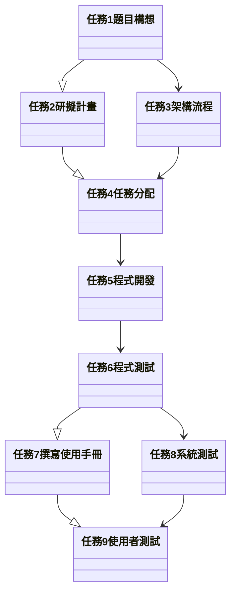

### 期末專題報告:
|職位|姓名|學號|任務|
|:--:|:--:|:--:|:--:|
|組長|沈煒皓|C109118129|監督|
|組員|王貿新|C109118130|程式開發|
|組員|柯永誠|C1091110|資料庫|
|組員|李昱承|C109118122|文書|
|組員|曾忠隆|C109126156|測試專員|
---
### 內容:

---
### 任務內容:
| 任務 | 說明 | 需時(天) | 前置任務 |
| :-: | :---------: | :--------: | :-----: |
| 1 | 題目構想| 1 | - |
| 2 | 研擬計畫 | 1 | 1 |
| 3 | 架構流程 | 1 | 1 |
| 4 | 任務分配 | 4 | 2, 3 |
| 5 | 程式開發 | 70 | 4 |
| 6 | 程序測試 | 25 | 5 |
| 7 | 撰寫使用手冊 | 15 | 6 |
| 8 | 系統測試 | 20 | 6 |
| 9 | 使用者測試 | 20 | 7, 8 |
---
### 甘特圖:

---
### PERT/CPM圖:

