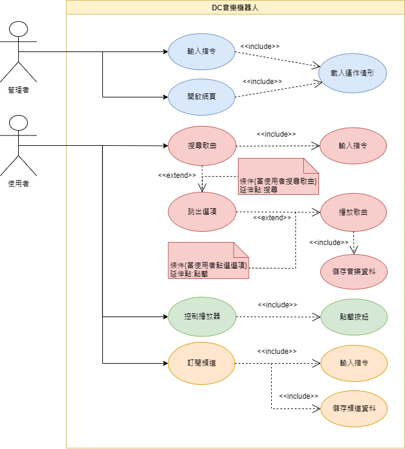

### 讓聊天不再單調——DC音樂機器人
|職位|姓名|學號|任務|
|:--:|:--:|:--:|:--:|
|組長|沈煒皓|C109118129|監督|
|組員|王貿新|C109118130|程式開發|
|組員|柯永誠|C10911810|資料庫|
|組員|李昱承|C109118122|文書|
|組員|曾忠隆|C109126156|測試專員|
---
### 內容:

本bot為使用戶在操作Discord軟體時，能夠快速在文字頻道當中獲取想要聆聽的音樂，並在語音頻道即時的分享給朋友聆聽。

範疇：
所有的Discord用戶

---
### 任務內容:
| 任務 | 說明 | 需時(天) | 前置任務 |
| :-: | :---------: | :--------: | :-----: |
| 1 | 題目構想 | 1 | - |
| 2 | 研擬計畫 | 1 | 1 |
| 3 | 架構流程 | 2 | 1 |
| 4 | 任務分配 | 3 | 2, 3 |
| 5 | 資料庫建立 | 15 | 4 |
| 6 | 程式開發 | 40 | 4 |
| 7 | 程式測試 | 10 | 5, 6 |
| 8 | 撰寫使用手冊 | 5 | 7 |
| 9 | 使用者訓練 | 2 | 8 |
| 10 | 使用者測試 | 7 | 9 |
---
### 甘特圖:

---
### PERT/CPM圖:

關鍵路徑: 1 -> 3 -> 4 -> 6 -> 7 -> 8 -> 9 -> 10
---
### 功能性需求與非功能性需求:
功能性需求:
- 提供搜尋功能
- 提供基本MP3功能
- 提供音樂推薦功能
- 提供新影片推播
- 提供管理後台

非功能性需求:
- 效能問題
> 能夠快速的反映結果
- 使用性
> UI化的控制面版，易於操作與使用
- 維護性
> 原始碼做註解，以便下一次的維護
- 可靠度
> 24hr運作，不會造成無法使用的問題
- 資料安全
> 使用本地資料庫，以及做好sql注入攻擊的防護

---
### 功能分解圖:

---
### 需求分析圖及文字說明:
一個DC音樂機器人的需求分析簡述如下：
- 管理者可以藉由輸入指令來獲取當前運行的狀況。
- 管理者可以藉由加載網頁來獲取當前運行的狀況。
- 使用者可以藉由輸入指令來搜尋音樂且能夠選擇音樂後播放音樂。
- 使用者可以藉由輸入指令來訂閱頻道獲得最新動態通知。
- 訂閱任何頻道都要儲存頻道資料
- 播放任何音樂都要儲存音樂資料

---
### 使用案例圖與使用案例說明:
1.使用者透過搜尋找到喜歡的音樂並聆聽 
2.使用者透過播放器上面的按鈕來播放與暫停 
3.使用者透過指令來追蹤喜歡的頻道 

使用案例說明 - 1:

| 使用案例名稱 | 搜尋歌曲 |
|:------------|:--------|
|**行動者:**|使用者|
|**說明:**|如何透過搜尋找到喜歡的音樂|
|**完成動作:**|1.輸入指令，並在搜尋欄輸入關鍵字 2.搜尋後，跳出可能的音樂選項 3.點選選項後，開始播放|

使用案例圖 - 1: 

使用案例說明 - 2:
| 使用案例名稱 | 控制播放器 |
|:------------|:----------|
|**行動者:**|使用者|
|**說明:**|如何控制播放器|
|**完成動作:**|1.按下按鈕後便會執行對應動作|

使用案例圖 - 2: 

使用案例說明 - 3:
| 使用案例名稱 | 訂閱頻道 |
|:------------|:--------|
|**行動者:**|使用者|
|**說明:**|如何追蹤喜歡的頻道|
|**完成動作:**|1.輸入指令，並在指令內填入參數 2.送出後，系統會做紀錄 3.完成後，即可在頻道有動作時推播|

使用案例圖 - 3: 

---
### 動態模擬畫面:
[使用者案例1模擬畫面](https://www.figma.com/proto/Zo0ObYiY29YDC16TDFRk66/Untitled?node-id=7%3A1415&scaling=min-zoom&page-id=0%3A1&starting-point-node-id=7%3A1415)

### DFD:

### DFD-level0:

